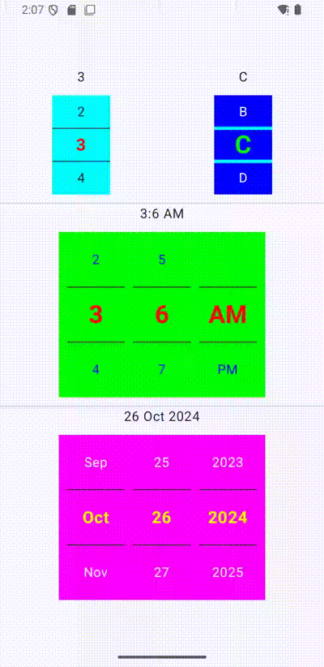

# Jetpack Compose Pickers

This library provides customizable **NumberPicker**, **TimePicker**, and **DatePicker** components for Jetpack Compose. Each picker allows you to easily display and select values with a modern, Compose-friendly API, supporting customization of appearance and behavior.

## Features

- **NumberPicker**: Choose from a list of numeric values with flexible text and divider customization.
- **TimePicker**: Select hours and minutes, supporting both 12-hour and 24-hour formats.
- **DatePicker**: Choose a date from a scrollable calendar view.
- Customizable text styles for selected and unselected items.
- Divider styling between picker items.
- Easy integration with Jetpack Compose's state management.


## Screenshot:



## Usage

1. NumberPicker

NumberPicker allows users to scroll and select a numeric value from a list.

Example:

```kotlin
@Composable
private fun HorizontalNumberPicker() {
    val values = 1..10
    NumberPicker(
        modifier = Modifier
            .size(width = 150.dp, height = 100.dp),
        values = values,
        onValueChanged = { index ->

        },
        selectedTextStyle = PickerTextStyle(
            fontWeight = FontWeight.Bold,
            textSize = 20.sp,
            textColor = Color.Red
        ),
    )
}
```

2. TimePicker

TimePicker enables users to pick a specific time (hours and minutes). You can choose between 12-hour or 24-hour formats.

Example:

```kotlin
@Composable
private fun AMPMTimePickerPreview() {
    TimePicker(
        initialTime = AMPMTime.NOW,
        modifier = Modifier
            .background(color = Color.LightGray)
            .size(width = 340.dp, height = 300.dp),
        onValueChanged = { time ->

        },
    )
}
```

3. DatePicker

DatePicker lets users scroll and select a date (year, month, day) in a scrollable calendar-like format.

Example:

```kotlin
@Composable
private fun DatePickerPreview() {
    DatePicker(
        modifier = Modifier
            .size(width = 340.dp, height = 300.dp),
        onValueChanged = { date ->

        },
        selectedTextStyle = PickerTextStyle(
            fontWeight = FontWeight.Bold,
            textSize = 20.sp,
            textColor = Color.Green
        ),
        unselectedTextStyle = PickerTextStyle(
            textColor = Color.LightGray,
        ),
        dividerStyle = PickerDividerStyle(
            thickness = 2.dp,
            color = Color.Cyan
        )
    )
}
```

## Customization

All three pickers (NumberPicker, TimePicker, DatePicker) support the following customizable options:

Text Styles: You can specify different styles for selected and unselected items using PickerTextStyle, allowing you to adjust font size, color, and weight.

Divider Styling: Customize dividers between picker items using PickerDividerStyle to modify their color and thickness.

Example of Custom Styles:

```kotlin
NumberPicker(
    modifier = Modifier
         .size(width = 150.dp, height = 100.dp),
    values = (0..10),
    selectedTextStyle = PickerTextStyle(fontSize = 22.sp, fontWeight = FontWeight.Bold, textColor = Color.Blue),
    unselectedTextStyle = PickerTextStyle(fontSize = 16.sp, fontWeight = FontWeight.Light, textColor = Color.Gray),
    dividerStyle = PickerDividerStyle(color = Color.Black, thickness = 1.dp)
)
```
